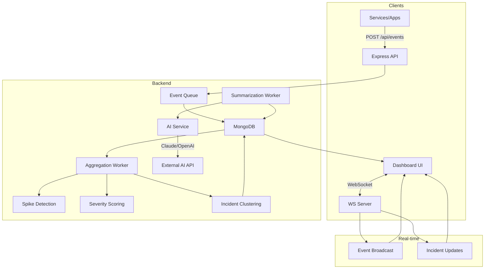

# Real-Time Incident Intelligence Dashboard

A modern, full-stack incident management system that aggregates system events, clusters them into incidents using AI-powered analysis, and provides real-time monitoring through an intuitive dashboard.

## Problem Statement

Modern distributed systems generate thousands of events per minute across multiple services. Operations teams struggle to:

- **Identify patterns** in the noise of individual events
- **Prioritize incidents** based on actual business impact
- **Understand root causes** quickly during outages
- **Track incident history** and resolution patterns

## Solution Overview

This dashboard solves these challenges by:

1. **Ingesting events** in real-time via REST API with WebSocket broadcasting
2. **Clustering related events** into incidents using service affinity and time windows
3. **Scoring severity** based on service criticality, event frequency spikes, and historical baselines
4. **Generating AI summaries** that identify root causes and suggest remediation actions
5. **Providing a live dashboard** with virtualized event streams and interactive timelines

## Architecture



## Tech Stack

| Component | Technology | Version |
|-----------|------------|---------|
| **Backend** | Node.js | ≥18.0.0 |
| | Express.js | 4.18.x |
| | MongoDB | 6.0+ |
| | Mongoose | 8.0.x |
| | WebSocket (ws) | 8.14.x |
| **Frontend** | React | 18.2.x |
| | Vite | 5.0.x |
| | Tailwind CSS | 3.4.x |
| | Zustand | 4.4.x |
| | Recharts | 2.10.x |
| | react-window | 1.8.x |
| **AI** | Anthropic Claude | claude-3-haiku |
| | OpenAI (alt) | gpt-3.5-turbo |
| **Monitoring** | prom-client | 15.1.x |

## Environment Variables

### Server (`server/.env`)

```env
# Server Configuration
PORT=5000
NODE_ENV=development

# MongoDB
MONGODB_URI=mongodb://localhost:27017/incident-intelligence

# AI Service (choose one provider)
AI_PROVIDER=claude                    # 'claude' or 'openai'
ANTHROPIC_API_KEY=sk-ant-...         # Required for Claude
CLAUDE_MODEL=claude-3-haiku-20240307
OPENAI_API_KEY=sk-...                # Required for OpenAI
OPENAI_MODEL=gpt-3.5-turbo
```

### Client (`client/.env`)

```env
VITE_API_URL=http://localhost:5000/api
VITE_WS_URL=ws://localhost:5000
```

## Local Development Setup

### Prerequisites

- Node.js 18+
- Docker & Docker Compose (for MongoDB)
- An Anthropic or OpenAI API key

### 1. Start MongoDB with Docker

```bash
# Create docker-compose.yml in project root
cat > docker-compose.yml << 'EOF'
version: '3.8'
services:
  mongodb:
    image: mongo:6.0
    container_name: incident-mongo
    ports:
      - "27017:27017"
    volumes:
      - mongo_data:/data/db
    environment:
      - MONGO_INITDB_DATABASE=incident-intelligence

volumes:
  mongo_data:
EOF

# Start MongoDB
docker-compose up -d
```

### 2. Setup & Start Server

```bash
cd server
cp .env.example .env
# Edit .env with your API keys

npm install
npm run dev
```

### 3. Setup & Start Client

```bash
cd client
cp .env.example .env
npm install
npm run dev
```

### 4. Access the Dashboard

- **Dashboard**: http://localhost:3000
- **API**: http://localhost:5000
- **Health**: http://localhost:5000/health
- **Metrics**: http://localhost:5000/metrics

## API Documentation

### Events

| Method | Endpoint | Description |
|--------|----------|-------------|
| `POST` | `/api/events` | Ingest a new event |
| `GET` | `/api/events` | List events (paginated) |
| `GET` | `/api/events/:eventId` | Get event by ID |
| `GET` | `/api/events/stats` | Event statistics |

#### Create Event Request

```json
POST /api/events
Content-Type: application/json

{
  "service": "payment-service",
  "severity": 4,
  "metadata": {
    "errorType": "ConnectionTimeout",
    "message": "Database connection pool exhausted",
    "requestId": "req-12345"
  },
  "tags": ["database", "timeout"]
}
```

#### Response

```json
{
  "success": true,
  "message": "Event created successfully",
  "data": {
    "eventId": "evt_abc123",
    "service": "payment-service",
    "severity": 4,
    "timestamp": "2024-01-15T10:30:00.000Z",
    "metadata": { ... },
    "tags": ["database", "timeout"]
  }
}
```

### Incidents

| Method | Endpoint | Description |
|--------|----------|-------------|
| `GET` | `/api/incidents` | List incidents |
| `GET` | `/api/incidents/active` | Active incidents only |
| `GET` | `/api/incidents/:incidentId` | Get incident details |
| `PATCH` | `/api/incidents/:incidentId` | Update incident |
| `GET` | `/api/incidents/stats` | Incident statistics |

### AI Service

| Method | Endpoint | Description |
|--------|----------|-------------|
| `GET` | `/api/ai/health` | AI service health |
| `GET` | `/api/ai/metrics` | AI metrics |
| `POST` | `/api/ai/summarize/:incidentId` | Manually trigger summary |
| `GET` | `/api/ai/circuit-breaker` | Circuit breaker status |
| `POST` | `/api/ai/circuit-breaker/reset` | Reset circuit breaker |

### Metrics & Health

| Method | Endpoint | Description |
|--------|----------|-------------|
| `GET` | `/metrics` | Prometheus metrics |
| `GET` | `/health` | Health check |
| `GET` | `/health/detailed` | Detailed health info |
| `GET` | `/health/live` | Kubernetes liveness |
| `GET` | `/health/ready` | Kubernetes readiness |

## WebSocket Events

### Connection

```javascript
const ws = new WebSocket('ws://localhost:5000');

ws.onopen = () => {
  // Subscribe to specific services or 'all'
  ws.send(JSON.stringify({
    type: 'subscribe',
    channels: ['payment-service', 'auth-service']
  }));
};
```

### Message Types

#### Event Received
```json
{
  "type": "event",
  "data": {
    "eventId": "evt_abc123",
    "service": "payment-service",
    "severity": 4,
    "timestamp": "2024-01-15T10:30:00.000Z",
    "metadata": { ... }
  },
  "timestamp": "2024-01-15T10:30:00.100Z"
}
```

#### Incident Created/Updated
```json
{
  "type": "incident",
  "action": "created | updated | summary_updated",
  "data": {
    "incidentId": "inc_xyz789",
    "severityScore": 4,
    "status": "active",
    "affectedServices": ["payment-service"],
    "aiGeneratedSummary": "Database connection issues...",
    "suggestedActions": ["Restart connection pool", "..."]
  },
  "timestamp": "2024-01-15T10:30:05.000Z"
}
```

## Production Deployment

### Docker Build

```dockerfile
# server/Dockerfile
FROM node:18-alpine
WORKDIR /app
COPY package*.json ./
RUN npm ci --only=production
COPY . .
EXPOSE 5000
CMD ["node", "index.js"]
```

### Kubernetes Deployment

```yaml
apiVersion: apps/v1
kind: Deployment
metadata:
  name: incident-intelligence
spec:
  replicas: 3
  selector:
    matchLabels:
      app: incident-intelligence
  template:
    spec:
      containers:
      - name: api
        image: incident-intelligence:latest
        ports:
        - containerPort: 5000
        env:
        - name: MONGODB_URI
          valueFrom:
            secretKeyRef:
              name: incident-secrets
              key: mongodb-uri
        livenessProbe:
          httpGet:
            path: /health/live
            port: 5000
        readinessProbe:
          httpGet:
            path: /health/ready
            port: 5000
```

### Environment Considerations

- Use MongoDB Atlas or a managed MongoDB service
- Configure Redis for session storage in multi-instance deployments
- Set up Prometheus/Grafana for metrics visualization
- Use a reverse proxy (nginx/traefik) for SSL termination
- Configure rate limiting at the load balancer level

## Screenshots

*Dashboard overview showing live event stream, active incidents, and timeline*


*Incident detail with AI-generated summary and suggested actions*


*Timeline view with severity distribution*


## Testing

### Run Server Tests

```bash
cd server
npm test
```

### Generate Test Events

```bash
# Send test events
curl -X POST http://localhost:5000/api/events \
  -H "Content-Type: application/json" \
  -d '{
    "service": "test-service",
    "severity": 3,
    "metadata": { "message": "Test event" }
  }'
```

## Contributing

1. Fork the repository
2. Create a feature branch (`git checkout -b feature/amazing-feature`)
3. Commit your changes (`git commit -m 'Add amazing feature'`)
4. Push to the branch (`git push origin feature/amazing-feature`)
5. Open a Pull Request

### Code Style

- Use ESLint with the provided configuration
- Follow the existing code patterns
- Write tests for new features
- Update documentation as needed

## License

MIT License - see [LICENSE](LICENSE) for details.

## Acknowledgments

- [Anthropic Claude](https://www.anthropic.com/) for AI summarization
- [Recharts](https://recharts.org/) for timeline visualization
- [Tailwind CSS](https://tailwindcss.com/) for styling
