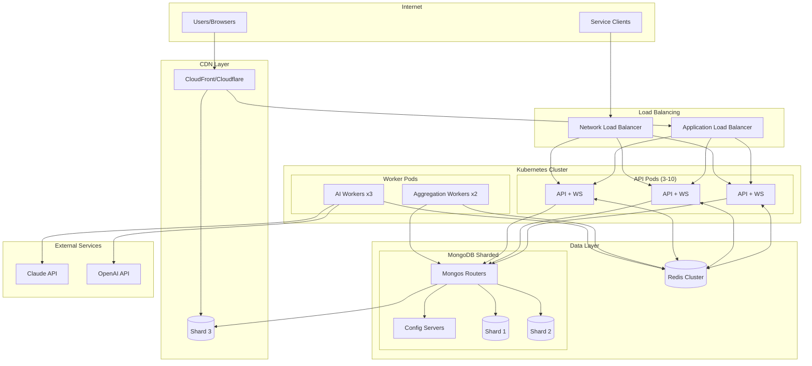

# Scaling Strategy: 10,000 Events/Minute

This document outlines the infrastructure and architectural changes needed to scale the Incident Intelligence Dashboard to handle 10,000 events per minute (167 events/second peak).

## Current Baseline

| Metric | Single Instance Capacity |
|--------|-------------------------|
| Event ingestion | ~1,000/minute |
| WebSocket connections | ~1,000 concurrent |
| MongoDB writes | ~500/second |
| AI summarization | ~2 calls/minute |

## Target Architecture

```
┌─────────────────────────────────────────────────────────────────────────────┐
│                              CDN (CloudFront/Cloudflare)                     │
│                         Static Assets + API Caching                          │
└─────────────────────────────────────────────────────────────────────────────┘
                                       │
                                       ▼
┌─────────────────────────────────────────────────────────────────────────────┐
│                        Load Balancer (ALB/nginx)                             │
│                    WebSocket Sticky Sessions (IP Hash)                       │
└─────────────────────────────────────────────────────────────────────────────┘
                    │                    │                    │
                    ▼                    ▼                    ▼
            ┌─────────────┐      ┌─────────────┐      ┌─────────────┐
            │   API Pod   │      │   API Pod   │      │   API Pod   │
            │  (Express)  │      │  (Express)  │      │  (Express)  │
            │  + WebSocket│      │  + WebSocket│      │  + WebSocket│
            └──────┬──────┘      └──────┬──────┘      └──────┬──────┘
                   │                    │                    │
                   └────────────────────┼────────────────────┘
                                        │
                                        ▼
                         ┌──────────────────────────┐
                         │      Redis Cluster       │
                         │   (Pub/Sub + Sessions)   │
                         └──────────────────────────┘
                                        │
            ┌───────────────────────────┼───────────────────────────┐
            │                           │                           │
            ▼                           ▼                           ▼
    ┌───────────────┐          ┌───────────────┐          ┌───────────────┐
    │  MongoDB      │          │  MongoDB      │          │  MongoDB      │
    │  Shard 1      │          │  Shard 2      │          │  Shard 3      │
    │  (Week 1-2)   │          │  (Week 3-4)   │          │  (Current)    │
    └───────────────┘          └───────────────┘          └───────────────┘

                         ┌──────────────────────────┐
                         │     AI Worker Pool       │
                         │   (Dedicated Instances)  │
                         └──────────────────────────┘
                                        │
                                        ▼
                         ┌──────────────────────────┐
                         │    AI Request Queue      │
                         │       (Redis/SQS)        │
                         └──────────────────────────┘
```

## 1. Horizontal Scaling: Express API

### Configuration

```yaml
# kubernetes/api-deployment.yaml
apiVersion: apps/v1
kind: Deployment
metadata:
  name: incident-api
spec:
  replicas: 5
  selector:
    matchLabels:
      app: incident-api
  template:
    spec:
      containers:
      - name: api
        image: incident-intelligence:latest
        resources:
          requests:
            cpu: "500m"
            memory: "512Mi"
          limits:
            cpu: "2000m"
            memory: "2Gi"
        env:
        - name: NODE_OPTIONS
          value: "--max-old-space-size=1536"
```

### Horizontal Pod Autoscaler

```yaml
apiVersion: autoscaling/v2
kind: HorizontalPodAutoscaler
metadata:
  name: incident-api-hpa
spec:
  scaleTargetRef:
    apiVersion: apps/v1
    kind: Deployment
    name: incident-api
  minReplicas: 3
  maxReplicas: 10
  metrics:
  - type: Resource
    resource:
      name: cpu
      target:
        type: Utilization
        averageUtilization: 70
  - type: Pods
    pods:
      metric:
        name: http_requests_per_second
      target:
        type: AverageValue
        averageValue: "100"
```

### Load Balancer Configuration

```nginx
# nginx load balancer config
upstream api_servers {
    least_conn;
    server api-1:5000 weight=1;
    server api-2:5000 weight=1;
    server api-3:5000 weight=1;
    keepalive 64;
}

upstream websocket_servers {
    ip_hash;  # Sticky sessions for WebSocket
    server api-1:5000;
    server api-2:5000;
    server api-3:5000;
}

server {
    location /api/ {
        proxy_pass http://api_servers;
        proxy_http_version 1.1;
        proxy_set_header Connection "";
    }

    location /ws {
        proxy_pass http://websocket_servers;
        proxy_http_version 1.1;
        proxy_set_header Upgrade $http_upgrade;
        proxy_set_header Connection "upgrade";
        proxy_read_timeout 86400;
    }
}
```

## 2. WebSocket Multi-Instance Broadcasting

### Problem
With multiple API instances, WebSocket connections are distributed. An event received by Instance A must be broadcast to clients connected to Instance B.

### Solution: Redis Pub/Sub

```javascript
// server/services/redisPubSub.js
const Redis = require('ioredis');

class WebSocketBroadcaster {
  constructor() {
    this.publisher = new Redis(process.env.REDIS_URL);
    this.subscriber = new Redis(process.env.REDIS_URL);

    this.subscriber.subscribe('events', 'incidents');

    this.subscriber.on('message', (channel, message) => {
      const data = JSON.parse(message);
      this.localBroadcast(channel, data);
    });
  }

  // Publish to all instances
  async publish(channel, data) {
    await this.publisher.publish(channel, JSON.stringify(data));
  }

  // Broadcast to local WebSocket connections
  localBroadcast(channel, data) {
    const wss = getWebSocketServer();
    wss.clients.forEach(client => {
      if (client.readyState === WebSocket.OPEN) {
        client.send(JSON.stringify({ type: channel, data }));
      }
    });
  }
}
```

### Connection State in Redis

```javascript
// Track connections across instances
const connectionKey = `ws:connections:${instanceId}`;

async function trackConnection(clientId) {
  await redis.sadd(connectionKey, clientId);
  await redis.expire(connectionKey, 300); // 5 min TTL
}

async function getGlobalConnectionCount() {
  const keys = await redis.keys('ws:connections:*');
  let total = 0;
  for (const key of keys) {
    total += await redis.scard(key);
  }
  return total;
}
```

## 3. MongoDB Sharding Strategy

### Shard Key Selection

We shard by **timestamp (hashed)** for even distribution with time-range query support.

```javascript
// Enable sharding on database
sh.enableSharding("incident-intelligence")

// Shard events collection by timestamp
sh.shardCollection(
  "incident-intelligence.events",
  { timestamp: "hashed" }
)

// Shard incidents by creation time
sh.shardCollection(
  "incident-intelligence.incidents",
  { createdAt: "hashed" }
)
```

### Shard Configuration

```yaml
# 3 shards with replica sets
Shard 1: rs1 (3 nodes) - Primary for recent data
Shard 2: rs2 (3 nodes) - Historical data
Shard 3: rs3 (3 nodes) - Historical data

Config Servers: 3 nodes (replica set)
Mongos Routers: 2 nodes (behind API pods)
```

### Zone-Based Sharding for Hot Data

```javascript
// Keep recent data on fast storage
sh.addShardTag("shard1", "hot")
sh.addShardTag("shard2", "warm")
sh.addShardTag("shard3", "warm")

// Recent events (last 24h) on hot shard
sh.updateZoneKeyRange(
  "incident-intelligence.events",
  { timestamp: MinKey },
  { timestamp: new Date(Date.now() - 86400000) },
  "warm"
)

sh.updateZoneKeyRange(
  "incident-intelligence.events",
  { timestamp: new Date(Date.now() - 86400000) },
  { timestamp: MaxKey },
  "hot"
)
```

### Write Concern for Scale

```javascript
// Optimized write concern for high throughput
const event = await Event.create(eventData, {
  writeConcern: {
    w: 1,           // Acknowledge from primary only
    j: false,       // Don't wait for journal
    wtimeout: 1000  // 1 second timeout
  }
});

// For critical data (incidents)
const incident = await Incident.create(incidentData, {
  writeConcern: {
    w: "majority",
    j: true
  }
});
```

## 4. AI Request Queuing

### Separate Worker Pool Architecture

```
┌─────────────────┐     ┌─────────────────┐     ┌─────────────────┐
│   API Pod 1     │     │   API Pod 2     │     │   API Pod 3     │
│                 │     │                 │     │                 │
│  Queue Job ─────┼─────┼──► Redis Queue  ◄─────┼───── Queue Job  │
└─────────────────┘     └────────┬────────┘     └─────────────────┘
                                 │
                    ┌────────────┼────────────┐
                    ▼            ▼            ▼
            ┌─────────────┐ ┌─────────────┐ ┌─────────────┐
            │ AI Worker 1 │ │ AI Worker 2 │ │ AI Worker 3 │
            │             │ │             │ │             │
            │ Rate: 20/min│ │ Rate: 20/min│ │ Rate: 20/min│
            └─────────────┘ └─────────────┘ └─────────────┘
```

### Queue Implementation (Bull)

```javascript
// server/services/aiQueue.js
const Queue = require('bull');

const aiQueue = new Queue('ai-summarization', process.env.REDIS_URL, {
  defaultJobOptions: {
    attempts: 3,
    backoff: {
      type: 'exponential',
      delay: 2000
    },
    removeOnComplete: 100,
    removeOnFail: 1000
  },
  limiter: {
    max: 60,        // 60 jobs
    duration: 60000 // per minute (across all workers)
  }
});

// Producer (API pods)
async function queueSummarization(incidentId, priority = 'normal') {
  await aiQueue.add(
    { incidentId },
    {
      priority: priority === 'critical' ? 1 : 10,
      delay: priority === 'critical' ? 0 : 5000
    }
  );
}

// Consumer (AI workers)
aiQueue.process(5, async (job) => {
  const { incidentId } = job.data;
  const result = await aiService.summarizeIncident(incidentId);
  return result;
});
```

### AI Worker Deployment

```yaml
apiVersion: apps/v1
kind: Deployment
metadata:
  name: ai-worker
spec:
  replicas: 3
  template:
    spec:
      containers:
      - name: worker
        image: incident-ai-worker:latest
        env:
        - name: ANTHROPIC_API_KEY
          valueFrom:
            secretKeyRef:
              name: ai-secrets
              key: anthropic-key
        - name: REDIS_URL
          value: "redis://redis-cluster:6379"
        resources:
          requests:
            cpu: "200m"
            memory: "256Mi"
          limits:
            cpu: "500m"
            memory: "512Mi"
```

## 5. CDN Configuration

### CloudFront Distribution

```yaml
# terraform/cdn.tf
resource "aws_cloudfront_distribution" "dashboard" {
  origin {
    domain_name = aws_s3_bucket.static.bucket_regional_domain_name
    origin_id   = "S3-static"

    s3_origin_config {
      origin_access_identity = aws_cloudfront_origin_access_identity.oai.cloudfront_access_identity_path
    }
  }

  origin {
    domain_name = aws_lb.api.dns_name
    origin_id   = "API"

    custom_origin_config {
      http_port              = 80
      https_port             = 443
      origin_protocol_policy = "https-only"
    }
  }

  default_cache_behavior {
    allowed_methods  = ["GET", "HEAD"]
    cached_methods   = ["GET", "HEAD"]
    target_origin_id = "S3-static"

    cache_policy_id = aws_cloudfront_cache_policy.optimized.id

    viewer_protocol_policy = "redirect-to-https"
    compress               = true
  }

  # API routes - no caching
  ordered_cache_behavior {
    path_pattern     = "/api/*"
    allowed_methods  = ["DELETE", "GET", "HEAD", "OPTIONS", "PATCH", "POST", "PUT"]
    cached_methods   = ["GET", "HEAD"]
    target_origin_id = "API"

    cache_policy_id          = aws_cloudfront_cache_policy.disabled.id
    origin_request_policy_id = aws_cloudfront_origin_request_policy.all_viewer.id

    viewer_protocol_policy = "https-only"
  }
}
```

### Cache Headers for Static Assets

```javascript
// vite.config.js - Asset hashing for cache busting
export default {
  build: {
    rollupOptions: {
      output: {
        entryFileNames: 'assets/[name].[hash].js',
        chunkFileNames: 'assets/[name].[hash].js',
        assetFileNames: 'assets/[name].[hash].[ext]'
      }
    }
  }
}
```

### nginx Cache Headers

```nginx
location /assets/ {
    expires 1y;
    add_header Cache-Control "public, immutable";
    add_header X-Content-Type-Options "nosniff";
}

location /index.html {
    expires 0;
    add_header Cache-Control "no-cache, no-store, must-revalidate";
}
```

## Infrastructure Diagram (Mermaid)



## Estimated Costs (AWS us-east-1)

### Monthly Cost Breakdown

| Component | Specification | Monthly Cost |
|-----------|---------------|--------------|
| **Compute** | | |
| EKS Cluster | Control plane | $73 |
| API Pods (5x) | c6i.large (2 vCPU, 4GB) | $310 |
| AI Workers (3x) | t3.medium (2 vCPU, 4GB) | $90 |
| | | |
| **Database** | | |
| MongoDB Atlas | M30 (3 shards) | $1,200 |
| ElastiCache Redis | r6g.large cluster | $390 |
| | | |
| **Networking** | | |
| ALB | Standard usage | $50 |
| Data Transfer | 1TB/month | $90 |
| | | |
| **CDN & Storage** | | |
| CloudFront | 100GB transfer | $15 |
| S3 | 10GB storage | $3 |
| | | |
| **AI Services** | | |
| Claude API | ~10K summaries @ $0.01 | $100 |
| | | |
| **Monitoring** | | |
| CloudWatch | Logs + Metrics | $50 |
| | | |
| **Total** | | **~$2,370/month** |

### Cost Optimization Options

1. **Reserved Instances**: 30-40% savings on compute
2. **Spot Instances**: For AI workers (70% savings)
3. **MongoDB Serverless**: Pay-per-operation for variable load
4. **Regional pricing**: us-west-2 slightly cheaper

### Scaling Cost Curve

| Events/min | Est. Monthly Cost |
|------------|-------------------|
| 1,000 | $800 |
| 5,000 | $1,500 |
| 10,000 | $2,370 |
| 50,000 | $6,000 |
| 100,000 | $12,000 |

## Performance Targets

| Metric | Target | Measurement |
|--------|--------|-------------|
| Event ingestion latency | <100ms p99 | API response time |
| WebSocket broadcast delay | <50ms | Event to client |
| Dashboard load time | <2s | LCP metric |
| AI summary generation | <60s | Time to summary |
| System availability | 99.9% | Uptime monitoring |

## Migration Path

### Phase 1: Redis Integration (Week 1-2)
- Add Redis for session storage
- Implement pub/sub for WebSocket
- Deploy 3 API replicas

### Phase 2: MongoDB Scaling (Week 3-4)
- Migrate to MongoDB Atlas
- Configure replica set
- Add read replicas

### Phase 3: Worker Separation (Week 5-6)
- Extract AI workers to separate pods
- Implement Bull queue
- Add monitoring dashboards

### Phase 4: CDN & Full Scale (Week 7-8)
- Configure CloudFront
- Enable sharding if needed
- Load testing and tuning
